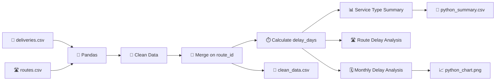

# 🚚 Delivery Delay Analysis — Task 3

<p align="center">
  
  
  
  
  
</p>

<p align="center">
  <b>📊 A Python-based delivery performance analysis project</b><br>
  Clean → Merge → Calculate → Analyze → Visualize → Export
</p>

---

## 📌 Overview

**Delivery Delay Analysis — Task 3** is a small end-to-end data analysis project built with **Python, Pandas, and Matplotlib**.

The project combines delivery records with route information, calculates delivery delays, summarizes delay performance by service type, identifies the route with the greatest accumulated delay, analyzes monthly delay totals, generates a chart, and exports cleaned/summary datasets.

> 🎯 **Primary goal:** turn raw delivery and route CSV data into structured, measurable delivery-delay insights.

---

## ✨ Key Features

| Feature | Description |
|---|---|
| 📥 Data Loading | Reads `deliveries.csv` and `routes.csv` |
| 🔢 Data Type Handling | Converts promised and actual delivery days into numeric values |
| 🧹 Data Cleaning | Removes duplicate delivery records |
| 🔗 Data Integration | Merges delivery and route datasets using `route_id` |
| ⏱️ Delay Calculation | Calculates actual delay against promised delivery time |
| 🛑 Negative Delay Handling | Treats early/on-time delivery as `0` delay |
| 📦 Service Analysis | Summarizes delay by service type |
| 📈 Delay Incidence | Calculates percentage of delayed records |
| 🛣️ Route Analysis | Finds the route with the highest total delay |
| 🗓️ Monthly Analysis | Calculates total delay for Jan, Feb, and Mar |
| 📊 Visualization | Generates a monthly delay bar chart |
| 💾 Export | Saves cleaned data and summary results as CSV |

---

## 🧠 Analysis Workflow



---

## 🗂️ Project Structure

```text
📦 Delivery-Delay-Analysis
│
├── 🐍 delivery_delay_analysis.py
│
├── 📄 deliveries.csv
├── 🛣️ routes.csv
│
├── 📊 clean_data.csv
├── 📋 python_summary.csv
├── 📈 python_chart.png
│
└── 📘 README.md
```

> `clean_data.csv`, `python_summary.csv`, and `python_chart.png` are generated by the Python script when it runs successfully.

---

## 🛠️ Tech Stack

### 🐍 Python
Core programming language used for the analysis.

### 🐼 Pandas
Used for:
- CSV loading
- data cleaning
- dataset merging
- grouping
- aggregation
- calculated columns
- CSV export

### 📊 Matplotlib
Used to create the **Monthly Total Delay Days** bar chart.

---

## 📥 Input Data

### `deliveries.csv`

Contains delivery-level information including:

- `record_id`
- `month`
- `route_id`
- `hub`
- `promised_days`
- `actual_days`

### `routes.csv`

Contains route reference information including:

- `route_id`
- `route`
- `service_type`

---

## 🧹 Data Preparation

The script performs the following preparation steps:

### 1️⃣ Load CSV files

```python
deliveries = pd.read_csv(folder + "/deliveries.csv")
routes = pd.read_csv(folder + "/routes.csv")
```

### 2️⃣ Convert delivery-day columns

```python
deliveries["promised_days"] = pd.to_numeric(deliveries["promised_days"])
deliveries["actual_days"] = pd.to_numeric(deliveries["actual_days"])
```

### 3️⃣ Remove duplicate records

```python
deliveries = deliveries.drop_duplicates()
```

### 4️⃣ Merge datasets

```python
df = pd.merge(deliveries, routes, on="route_id")
```

---

## ⏱️ Delay Calculation Logic

The project calculates delivery delay using:

```text
Delay = Actual Delivery Days − Promised Delivery Days
```

Implemented as:

```python
df["delay_days"] = df["actual_days"] - df["promised_days"]
```

If the calculated delay is negative, it is converted to `0`:

```python
df["delay_days"] = df["delay_days"].apply(
    lambda x: 0 if x < 0 else x
)
```

### 💡 Example

```text
Promised:  3 days
Actual:    5 days

Delay = 5 - 3
      = 2 days
```

If:

```text
Promised:  5 days
Actual:    4 days

Delay = 4 - 5
      = -1
```

The project records this as:

```text
Delay = 0 days
```

---

## 📊 Service Type Analysis

The project calculates:

- Total delay days
- Total records
- Delayed records
- Delay incidence rate

### 📐 Delay Incidence Rate

```text
Delayed Records
---------------- × 100
Total Records
```

Implemented as:

```python
summary["delay_incidence_rate"] = (
    summary["delayed_records"] /
    summary["records"] * 100
)
```

### 📋 Generated Summary Columns

```text
service_type
total_delay_days
records
delayed_records
delay_incidence_rate
```

---

## 🛣️ Route Performance Analysis

The project groups delay by:

```text
route_id + route
```

Then sorts routes from highest to lowest accumulated delay.

The route at the top of the resulting table is treated as the route with the greatest total delay.

```python
route_delay = df.groupby(
    ["route_id", "route"]
)["delay_days"].sum().reset_index()

route_delay = route_delay.sort_values(
    "delay_days",
    ascending=False
)

top_route = route_delay.head(1)
```

---

## 🧮 Overall Delay Metrics

The script calculates:

### Total Delay

```python
overall_delay = df["delay_days"].sum()
```

### Top Route Share

```python
top_route_share = (
    top_route["delay_days"].sum()
    / overall_delay
    * 100
)
```

This indicates what percentage of the project's total accumulated delay comes from the highest-delay route.

---

## 🗓️ Monthly Delay Analysis

The project calculates total delay by month:

```python
monthly = df.groupby("month")["delay_days"].sum()
```

The month order is explicitly arranged as:

```text
Jan → Feb → Mar
```

```python
month_order = ["Jan", "Feb", "Mar"]
monthly = monthly.reindex(month_order)
```

---

## 📈 Visualization

A bar chart is generated using Matplotlib.

### Chart

```text
Title  : Monthly Total Delay Days
X-axis : Month
Y-axis : Total Delay Days
```

The chart is saved as:

```text
python_chart.png
```

---

## 📤 Output Files

### 🧹 `clean_data.csv`

Contains the merged and processed dataset, including the calculated:

```text
delay_days
```

### 📋 `python_summary.csv`

Contains the service-type level summary:

```text
service_type
total_delay_days
records
delayed_records
delay_incidence_rate
```

### 📈 `python_chart.png`

Contains the monthly total-delay visualization.

---

## 🔎 Dataset Results

Using the supplied dataset, the analysis produces:

| Metric | Result |
|---|---:|
| 📦 Total delivery records | 12 after duplicate removal |
| ⏱️ Overall accumulated delay | **34 days** |
| 🛣️ Highest-delay route | **R4 — Rural Feeder** |
| 🔥 Highest route delay | **14 days** |
| 📊 Highest route share of total delay | **41.18%** |
| 🚚 Express total delay | **12 days** |
| 🚛 Standard total delay | **22 days** |
| 🟢 Express delayed records | **4 / 6** |
| 🟠 Standard delayed records | **5 / 6** |
| 📈 Express delay incidence | **66.67%** |
| 📈 Standard delay incidence | **83.33%** |

> These figures are generated from the supplied CSV files by executing the provided analysis script.

---

## 🚀 Getting Started

### 1️⃣ Clone or download the project

Place all project files inside the same directory.

### 2️⃣ Install dependencies

```bash
pip install pandas matplotlib
```

### 3️⃣ Verify the project structure

Make sure these files exist together:

```text
delivery_delay_analysis.py
deliveries.csv
routes.csv
```

### 4️⃣ Run the analysis

```bash
python delivery_delay_analysis.py
```

### 5️⃣ Check generated outputs

After successful execution, the project creates:

```text
clean_data.csv
python_summary.csv
python_chart.png
```

---

## 🧪 Reproducible Analysis Pipeline

```text
RAW DATA
   ↓
CSV INPUT
   ↓
TYPE CONVERSION
   ↓
DUPLICATE REMOVAL
   ↓
DATASET MERGE
   ↓
DELAY CALCULATION
   ↓
SERVICE TYPE ANALYSIS
   ↓
ROUTE ANALYSIS
   ↓
MONTHLY ANALYSIS
   ↓
VISUALIZATION
   ↓
CSV EXPORT
```

---

## 📌 Important Assumptions

The current implementation follows these rules:

- Delay is calculated as `actual_days - promised_days`.
- Negative delay values are converted to `0`.
- Duplicate rows are removed from `deliveries`.
- `deliveries.csv` and `routes.csv` are joined using `route_id`.
- Delay incidence is based on records where `actual_days > promised_days`.
- Monthly output is ordered as `Jan`, `Feb`, `Mar`.
- The highest-delay route is identified from accumulated `delay_days`.

---

## 💡 What This Project Demonstrates

This project demonstrates practical skills in:

- 🐍 Python scripting
- 🐼 Pandas data manipulation
- 🧹 Basic data cleaning
- 🔗 Relational data merging
- 📊 GroupBy aggregation
- 🧮 KPI calculation
- 📈 Data visualization
- 📁 CSV input/output
- 🔍 Operational performance analysis
- ♻️ Reproducible data workflows

---

## 🔮 Possible Future Enhancements

The current project can be extended with:

- [ ] 📊 Interactive dashboard using Plotly
- [ ] 📈 Service-type comparison charts
- [ ] 🛣️ Route-wise visualization
- [ ] 🗓️ More flexible date/month handling
- [ ] 🧹 Missing-value validation
- [ ] 🚨 Automatic delay severity categories
- [ ] 📋 Automated report generation
- [ ] 🌐 Streamlit dashboard
- [ ] 🧪 Unit tests for calculations
- [ ] ⚙️ Command-line arguments for input/output paths
- [ ] 📦 `requirements.txt`
- [ ] 🔄 Automated data pipeline

---

## 👤 Author

**Indrajeet Maheshwari**

## 📌 Project

**Delivery Delay Analysis — Task 3**

Built as a practical Python data-analysis exercise focused on transforming raw delivery data into useful operational insights.

---

## ⭐ If You Found This Project Useful

If you're learning Python and data analysis, this project is a good example of a simple but complete workflow:

**Load → Clean → Merge → Calculate → Analyze → Visualize → Export**

<p align="center">
  <b>📊 Data becomes valuable when it tells a clear story.</b>
</p>
